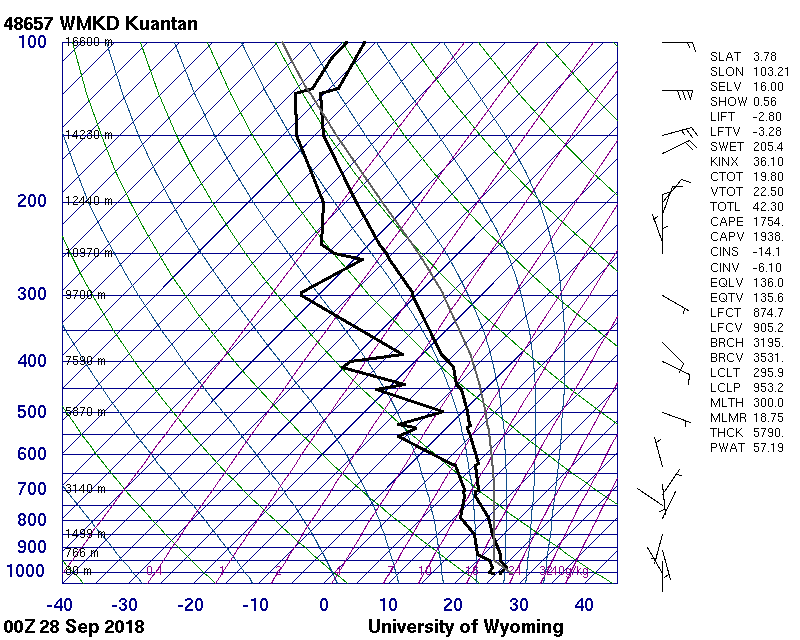

# unsound

Retrieve Current and Historical Upper Air Soundings Data from the
University of Wyoming

## Description

The University of Wyoming maintains a server
(<http://weather.uwyo.edu/upperair/sounding.html>) that provides an
interface to query current and historical upper air soundings data.
Tools are provided to query this service and retrieve the
    data.

Ref:

  - <https://stackoverflow.com/questions/52535696/save-content-in-web-as-data-frame/52539658#52539658>
  - <https://stackoverflow.com/questions/52543892/web-scraping-using-httr-give-xml-nodeset-error/52545775?noredirect=1#comment92066543_52545775>

## What’s Inside The Tin

The following functions are implemented:

  - `get_region_codes`: Retrive region names and codes
  - `get_sounding_data`: Get sounding data for a station
  - `rbind_soundings`: Turn a list of soundings data frames into a
    single data frame

## Installation

``` r
devtools::install_github("hrbrmstr/unsound")
```

## Usage

``` r
library(unsound)
library(magick)
library(tidyverse) # overkill since it's just for data frame pretty printing

# current verison
packageVersion("unsound")
```

    ## [1] '0.1.0'

### Region codes

``` r
get_region_codes()
```

    ## # A tibble: 10 x 2
    ##    region_name    region_code
    ##    <chr>          <chr>      
    ##  1 North America  naconf     
    ##  2 South America  samer      
    ##  3 South Pacific  pac        
    ##  4 New Zealand    nz         
    ##  5 Antarctica     ant        
    ##  6 Arctic         np         
    ##  7 Europe         europe     
    ##  8 Africa         africa     
    ##  9 Southeast Asia seasia     
    ## 10 Mideast        mideast

### Full example (via the SO question(s))

``` r
# get the start/end range
startDate <- as.Date("01-11-17", format="%d-%m-%y")
endDate <- as.Date("31-01-18",format="%d-%m-%y")

# make a sequence
days <- seq(startDate, endDate, "1 day")

lapply(days[1:4], function(day) {
  
  Sys.sleep(3) # be kind to their servers
  
  get_sounding_data(
    region = "seasia",
    date = day,
    from_hr = "00",
    to_hr = "00",
    station_number = "48657"
  )
}) -> soundings_48657
```

    ## Warning in get_sounding_data(region = "seasia", date = day, from_hr = "00", : Can't get 48657 WMKD Kuantan Observations
    ## at 00Z 01 Nov 2017.

``` r
# Notice there's missing data for one day
str(soundings_48657)
```

    ## List of 4
    ##  $ :'data.frame':    0 obs. of  0 variables
    ##  $ :Classes 'tbl_df', 'tbl' and 'data.frame':    4 obs. of  14 variables:
    ##   ..$ pres_hpa : num [1:4] 1006 1000 993 981
    ##   ..$ hght_m   : num [1:4] 16 70 132 238
    ##   ..$ temp_c   : num [1:4] 24 23.6 23.2 24.6
    ##   ..$ dwpt_c   : num [1:4] 23.4 22.4 21.5 21.6
    ##   ..$ relh_pct : num [1:4] 96 93 90 83
    ##   ..$ mixr_g_kg: num [1:4] 18.4 17.4 16.6 16.9
    ##   ..$ drct_deg : num [1:4] 0 0 NA NA
    ##   ..$ sknt_knot: num [1:4] 0 0 NA NA
    ##   ..$ thta_k   : num [1:4] 297 297 297 299
    ##   ..$ thte_k   : num [1:4] 350 347 345 349
    ##   ..$ thtv_k   : num [1:4] 300 300 300 302
    ##   ..$ date     : Date[1:4], format: "2017-11-02" "2017-11-02" "2017-11-02" "2017-11-02"
    ##   ..$ from_hr  : chr [1:4] "00" "00" "00" "00"
    ##   ..$ to_hr    : chr [1:4] "00" "00" "00" "00"
    ##   ..- attr(*, "meta")= chr "48657 WMKD Kuantan Observations at 00Z 02 Nov 2017"
    ##  $ :Classes 'tbl_df', 'tbl' and 'data.frame':    83 obs. of  14 variables:
    ##   ..$ pres_hpa : num [1:83] 1005 1000 991 983 973 ...
    ##   ..$ hght_m   : num [1:83] 16 62 141 213 302 329 466 595 745 802 ...
    ##   ..$ temp_c   : num [1:83] 24.2 24.2 24 23.8 23.3 23.2 23.4 22.7 21.8 21.4 ...
    ##   ..$ dwpt_c   : num [1:83] 23.6 23.1 22.9 22.7 22 21.8 22 21.3 20.4 19.7 ...
    ##   ..$ relh_pct : num [1:83] 96 94 94 94 92 92 92 92 92 90 ...
    ##   ..$ mixr_g_kg: num [1:83] 18.6 18.2 18.1 18 17.4 ...
    ##   ..$ drct_deg : num [1:83] 190 210 212 213 215 215 212 210 210 210 ...
    ##   ..$ sknt_knot: num [1:83] 1 3 6 8 11 11 14 16 15 15 ...
    ##   ..$ thta_k   : num [1:83] 297 297 298 298 299 ...
    ##   ..$ thte_k   : num [1:83] 351 350 351 351 350 ...
    ##   ..$ thtv_k   : num [1:83] 300 301 301 302 302 ...
    ##   ..$ date     : Date[1:83], format: "2017-11-03" "2017-11-03" "2017-11-03" "2017-11-03" ...
    ##   ..$ from_hr  : chr [1:83] "00" "00" "00" "00" ...
    ##   ..$ to_hr    : chr [1:83] "00" "00" "00" "00" ...
    ##   ..- attr(*, "meta")= chr "48657 WMKD Kuantan Observations at 00Z 03 Nov 2017"
    ##  $ :Classes 'tbl_df', 'tbl' and 'data.frame':    89 obs. of  14 variables:
    ##   ..$ pres_hpa : num [1:89] 1005 1001 1000 993 987 ...
    ##   ..$ hght_m   : num [1:89] 16 54 63 125 178 304 322 597 747 898 ...
    ##   ..$ temp_c   : num [1:89] 24.8 24.4 24.4 23.6 25 24.6 24.6 22.9 22 20.9 ...
    ##   ..$ dwpt_c   : num [1:89] 24.2 23.4 23.2 21.8 22.6 21.4 21.2 20.4 19.9 19.1 ...
    ##   ..$ relh_pct : num [1:89] 96 94 93 90 87 82 81 86 88 89 ...
    ##   ..$ mixr_g_kg: num [1:89] 19.4 18.5 18.3 16.9 17.9 ...
    ##   ..$ drct_deg : num [1:89] 0 264 240 237 235 230 229 210 205 200 ...
    ##   ..$ sknt_knot: num [1:89] 0 2 2 4 5 9 10 19 20 19 ...
    ##   ..$ thta_k   : num [1:89] 298 298 298 297 299 ...
    ##   ..$ thte_k   : num [1:89] 354 351 351 346 352 ...
    ##   ..$ thtv_k   : num [1:89] 301 301 301 300 302 ...
    ##   ..$ date     : Date[1:89], format: "2017-11-04" "2017-11-04" "2017-11-04" "2017-11-04" ...
    ##   ..$ from_hr  : chr [1:89] "00" "00" "00" "00" ...
    ##   ..$ to_hr    : chr [1:89] "00" "00" "00" "00" ...
    ##   ..- attr(*, "meta")= chr "48657 WMKD Kuantan Observations at 00Z 04 Nov 2017"

``` r
# make one big data frame
soundings_48657 <- rbind_soundings(soundings_48657)

glimpse(soundings_48657)
```

    ## Observations: 176
    ## Variables: 14
    ## $ pres_hpa  <dbl> 1006, 1000, 993, 981, 1005, 1000, 991, 983, 973, 970, 955, 941, 925, 919, 909, 905, 877, 863, 850...
    ## $ hght_m    <dbl> 16, 70, 132, 238, 16, 62, 141, 213, 302, 329, 466, 595, 745, 802, 897, 935, 1209, 1348, 1479, 210...
    ## $ temp_c    <dbl> 24.0, 23.6, 23.2, 24.6, 24.2, 24.2, 24.0, 23.8, 23.3, 23.2, 23.4, 22.7, 21.8, 21.4, 21.5, 21.6, 2...
    ## $ dwpt_c    <dbl> 23.4, 22.4, 21.5, 21.6, 23.6, 23.1, 22.9, 22.7, 22.0, 21.8, 22.0, 21.3, 20.4, 19.7, 18.7, 18.3, 1...
    ## $ relh_pct  <dbl> 96, 93, 90, 83, 96, 94, 94, 94, 92, 92, 92, 92, 92, 90, 84, 82, 74, 77, 79, 82, 87, 84, 79, 83, 8...
    ## $ mixr_g_kg <dbl> 18.40, 17.39, 16.55, 16.87, 18.65, 18.17, 18.11, 18.03, 17.45, 17.28, 17.78, 17.23, 16.61, 15.99,...
    ## $ drct_deg  <dbl> 0, 0, NA, NA, 190, 210, 212, 213, 215, 215, 212, 210, 210, 210, 210, 212, 224, 230, 235, 220, 220...
    ## $ sknt_knot <dbl> 0, 0, NA, NA, 1, 3, 6, 8, 11, 11, 14, 16, 15, 15, 16, 16, 15, 15, 17, 20, 18, 18, 14, 12, 12, 14,...
    ## $ thta_k    <dbl> 296.6, 296.8, 296.9, 299.4, 296.9, 297.4, 297.9, 298.4, 298.8, 298.9, 300.5, 301.0, 301.6, 301.8,...
    ## $ thte_k    <dbl> 349.9, 347.1, 344.9, 348.8, 351.0, 350.1, 350.7, 351.1, 349.9, 349.5, 352.8, 351.8, 350.7, 349.1,...
    ## $ thtv_k    <dbl> 299.9, 299.8, 299.9, 302.4, 300.2, 300.6, 301.1, 301.6, 301.9, 302.0, 303.7, 304.1, 304.6, 304.6,...
    ## $ date      <date> 2017-11-02, 2017-11-02, 2017-11-02, 2017-11-02, 2017-11-03, 2017-11-03, 2017-11-03, 2017-11-03, ...
    ## $ from_hr   <chr> "00", "00", "00", "00", "00", "00", "00", "00", "00", "00", "00", "00", "00", "00", "00", "00", "...
    ## $ to_hr     <chr> "00", "00", "00", "00", "00", "00", "00", "00", "00", "00", "00", "00", "00", "00", "00", "00", "...

``` r
soundings_48657
```

    ## # A tibble: 176 x 14
    ##    pres_hpa hght_m temp_c dwpt_c relh_pct mixr_g_kg drct_deg sknt_knot thta_k thte_k thtv_k date       from_hr to_hr
    ##       <dbl>  <dbl>  <dbl>  <dbl>    <dbl>     <dbl>    <dbl>     <dbl>  <dbl>  <dbl>  <dbl> <date>     <chr>   <chr>
    ##  1    1006.    16.   24.0   23.4      96.      18.4       0.        0.   297.   350.   300. 2017-11-02 00      00   
    ##  2    1000.    70.   23.6   22.4      93.      17.4       0.        0.   297.   347.   300. 2017-11-02 00      00   
    ##  3     993.   132.   23.2   21.5      90.      16.6      NA        NA    297.   345.   300. 2017-11-02 00      00   
    ##  4     981.   238.   24.6   21.6      83.      16.9      NA        NA    299.   349.   302. 2017-11-02 00      00   
    ##  5    1005.    16.   24.2   23.6      96.      18.6     190.        1.   297.   351.   300. 2017-11-03 00      00   
    ##  6    1000.    62.   24.2   23.1      94.      18.2     210.        3.   297.   350.   301. 2017-11-03 00      00   
    ##  7     991.   141.   24.0   22.9      94.      18.1     212.        6.   298.   351.   301. 2017-11-03 00      00   
    ##  8     983.   213.   23.8   22.7      94.      18.0     213.        8.   298.   351.   302. 2017-11-03 00      00   
    ##  9     973.   302.   23.3   22.0      92.      17.4     215.       11.   299.   350.   302. 2017-11-03 00      00   
    ## 10     970.   329.   23.2   21.8      92.      17.3     215.       11.   299.   350.   302. 2017-11-03 00      00   
    ## # ... with 166 more rows

### Maps

``` r
get_sounding_map(
  station_number = "48657", 
  date = Sys.Date()-1, 
  map_type = "skewt", 
  map_format = "gif", 
  region = "seasia", 
  from_hr = "00", 
  to_hr = "00"
)
```

<!-- -->
